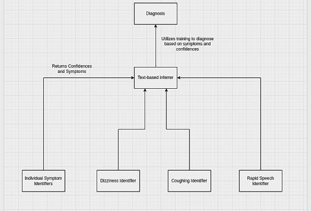

My project, VAaS, will make small electrical chips that will stop drug overdoses. VAaS is short for Vocal Analysis for abuse of Substance. I decided to name it after Vaas Montenegro, the drug-addicted fictional antagonist of Far Cry 3. He has a pretty iconic speech about the definition of insanity (doing the same thing over and over again and expecting different results), which applies heavily to the drug problem in the US. People keep trying the same things to combat drug overdoses, and while the effort is incredible and undeniably helps many people, the death toll continues to rise with the addition of new drugs into the urban drug ecosystem.

There have been more fentanyl deaths in 2023 than there have been total deaths in the United States Armed Forces since the 1970s.

My project, VAaS, will make small electrical chips that will stop drug overdoses. VAaS is short for Vocal Analysis for abuse of Substance. I decided to name it after Vaas Montenegro, the drug-addicted fictional antagonist of Far Cry 3. He has a pretty iconic speech about the definition of insanity (doing the same thing over and over again and expecting different results), which applies to the drug problem in the US. People keep trying the same things to combat drug overdoses, and while the effort is incredible and undeniably helps many people, the death toll continues to rise with the addition of new drugs into the urban drug ecosystem.

VAaS is, at its core, a collection of neural nets that are trained to recognize different symptoms of drug abuse and drug overdoses. The end goal is to have several chips that house the neural net. These chips will always be listening at places where drugs are commonly abused, including (but not limited to) raves, bars, and streets. Once audio patterns similar to the symptoms the neural net has been trained on are detected, local EMTs can be notified. This will help stop drug overdoses before it’s too late.

So far, we have trained different audio models on publicly available datasets to determine which one will be the best for our purposes. Since speech emotion recognition is relatively new, even the most developed models from billion-dollar companies need much work. However, we should have enough products to create a functional project in the foreseeable future.

The project’s end goal is to stop drug overdoses on a large scale. The San Francisco Bay Area, for example, has drug overdoses jumping by hundreds annually, soon to hit a thousand. Hundreds of thousands of people die annually because they are unable to get help fast enough. Working on VAaS’s end product and incorporating it into daily life can give these people a fighting chance.

One of the main setbacks I have come across in the creation of my prototype is collecting data. What I initially envisioned was the utilization of law enforcement data (namely bodycam audio and biometric data), but I was denied several requests from several different district courts. Instead, I decided to split the neural nets into several factions. VAaS is made up of several neural nets that are specifically trained to identify each symptom. There is one high-level neural net that takes the outputs of each symptom identifier and makes an educated guess as to which drug the person is on (and what stage they are at), and creates a diagnosis based on this.

There are Content Management (CMS) codes for treating drug overdoses, but there are none for preventing overdoses. This is an area that has been systematically ignored for years, though focusing on it would be leagues more effective.

